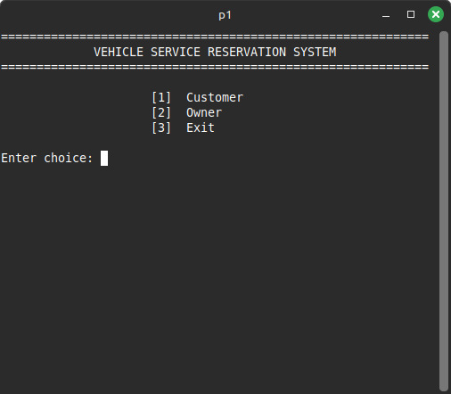
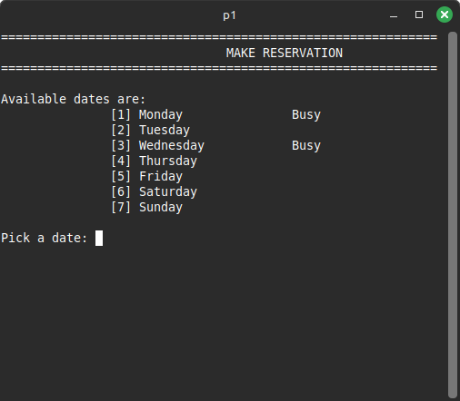
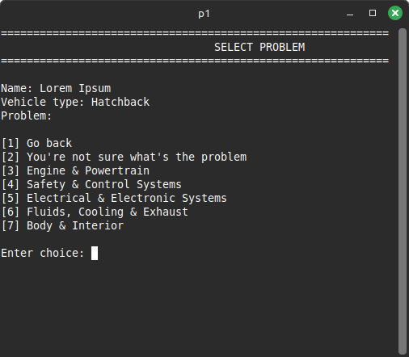
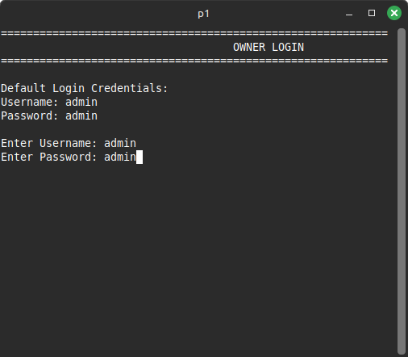

# Features
## Customer Panel

   - View available service dates (Monday–Sunday).
   - Make a reservation for an available date.
   - Enter customer information.

 - Select:
     - Vehicle category (Private, Public Transport, Commercial).
     - Specific vehicle type (e.g., Sedan, Jeepney, Truck).
     - Problem category (Engine, Electrical, Safety, etc.).

- Prevents double-booking of dates Select.
- Handles invalid input safely.

## Owner Panel (Login Required)

   - Secure owner login using global credentials.
   - View all reservations for the week.
   - See customer name, vehicle type, and reported problem per date.
   - Default credentials shown only on first login.

## System Design

 - Uses global arrays to store:
     - Reservation dates.
     - Availability status.
     - Customer details.
     - Vehicle information

 - Implements menu loops to prevent crashes from invalid input.
 - Clear CLI layout using iomanip for alignment.
 - Modular function-based structure for readability and maintenance.
 - Input validation to prevent infinite loops and crashes.

# Demo 

<table style="width:100%">
  <tr>
    <td>Main CLI:</td>
    <td>Customer CLI:</td>
  </tr>
  <tr>
    <td></td>
    <td></td>
  </tr>
</table>

<table style="width:100%">
  <tr>
    <td>Customer Choice:</td>
    <td>Owner CLI:</td>
  </tr>
  <tr>
    <td></td>
    <td></td>
  </tr>
</table>

# Note
This project is intended for learning and academic purposes, No external files or databases are used, Any data that's saved within the program reset when the program exits.

